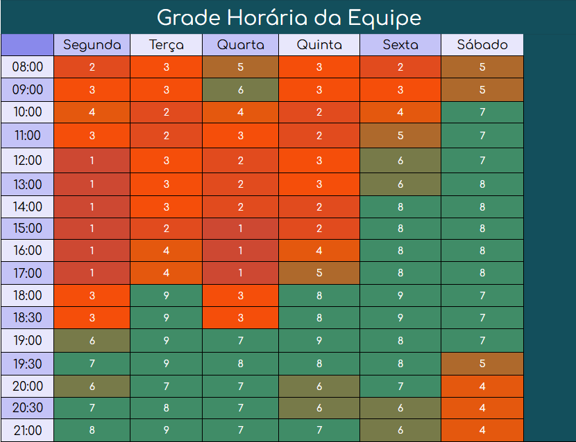

Estudamos os horários dos integrantes da equipe através de um mapa de calor, para termos uma noção de como organizariamos as atividades do grupo, e qual seria os melhores horários para as reuniões. A seguir temos a imagem 1 de como ficou nosso mapa de calor:

{: .imagem }

**
imagem 1** - Mapa de calor (Heatmap) - Fonte: Elaboração Própria (2024)

Através do estudo desse mapa foi possível identificar que, o melhor horário para a reunião semanal da equipe, seria na terça-feira as 18 horas. E a equipe também definiu que o melhor horário para reunião com cliente seria as 19 horas.

## Histórico de versão

| Versão |    Data    | Descrição da Alteração | Nome(s) Integrante(s) |
| :----: | :--------: | :--------------------: | :-------------------: |
|  1.0   | 09/02/2024 |   adição de heatmap    |       João Lobo       |
