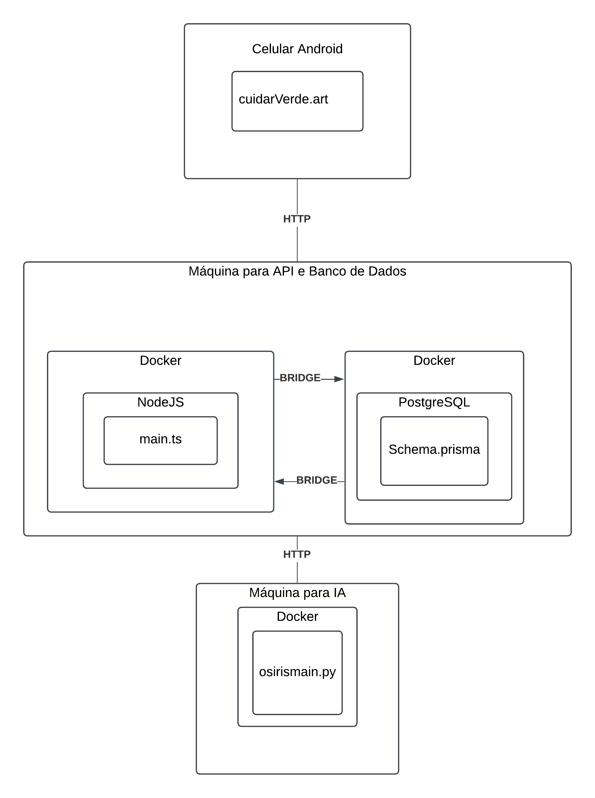

A implantação do sistema Cuidar Verde será realizada utilizando infraestrutura na nuvem para garantir alta disponibilidade, escalabilidade e facilidade de manutenção. A arquitetura será baseada em contêineres Docker e utilizará serviços gerenciados para banco de dados e computação.

#### Diagrama de implantação do sistema

{: .imagem }

**
Figura 17** - Diagrama de implantação do sistema - Fonte: Elaboração Própria (2024)

A figura 17 descreve uma visão geral de implantação do sistema desenvolvido e detalhes sobre tal implantação serão descritos nos tópicos que seguem. O diagrama descreve o hardware e comunicação necessários para implantar o sistema desenvolvido.

### Infraestrutura de Hardware e Serviços Nuvem

O sistema será implantado na Google Cloud Platform (GCP). As principais razões para a escolha incluem:

- Escalabilidade: Serviços que permitem escalar automaticamente com aumento de tráfego.
- Alto desempenho: Data centers distribuídos e otimizados.
- Suporte a ferramentas de IA: Integração direta com TensorFlow e serviços de machine learning.

### Serviços utilizados

**Compute Engine:**

- Servidores virtuais para execução do backend (NestJS) e processamento de requisições.
- Configuração inicial: 2 CPUs virtuais, 4GB de RAM, com capacidade para escalonamento automático.

**Cloud SQL (PostgreSQL):**

- Banco de dados objeto relacional gerenciado para armazenar credenciais, histórico de diagnósticos e feedbacks.
- Configuração inicial: Instância db-n1-standard-1, com 10GB de espaço e capacidade de escalonamento.

**AI Platform:**

- Serviço para treinar e hospedar o modelo de inteligência artificial (TensorFlow).

### Processo de Implantação:

A preparação do projeto envolve a conteinerização do backend e frontend utilizando Docker, o que assegura portabilidade e consistência em diferentes ambientes. Além disso, configuramos pipelines de CI/CD no GitHub Actions para automatizar os processos de build, teste e deploy, garantindo um fluxo contínuo e eficiente tanto no ambiente de desenvolvimento quanto em produção.

O frontend é empacotado em contêineres, facilitando sua distribuição em diferentes dispositivos Android e iOS. Ele é publicado e acessível por meio do Expo, com atualizações contínuas realizadas via Firebase Hosting, garantindo que os usuários tenham sempre acesso à versão mais recente do aplicativo.

O backend é implantado no Google Compute Engine, com endpoints RESTful que garantem a comunicação eficiente com o frontend. O banco de dados é configurado e migrado para o Cloud SQL, utilizando o Prisma ORM para facilitar a gestão das interações com as tabelas e esquemas. A inteligência artificial é executada de forma contínua na AI Platform, utilizando dados reais para realizar retraining e melhorias constantes, assegurando precisão e evolução no reconhecimento de doenças nas plantas.

### Justificativa da Infraestrutura:

A infraestrutura apresentada se dá tanto pelo alinhamento com as metas do projeto, observada a reflexão da necessidade de modularidade do projeto para permitir escalabilidade, organização e facilidade de manutenção e evolução do sistema, permitindo melhorias específicas em cada camada quanto pela necessidade de desempenho e disponibilidade, ao permitir que a infraestrutura esteja preparada para atender picos de tráfego com baixa latência de resposta e reduzir a carga de administração da infraestrutura.

## Restrições adicionais

Essa seção contém um relatório das restrições divulgadas pelo cliente cujo cumprimento diretamente impacta na qualidade do produto final e usabilidade para o usuário.

### Restrição I: Capacidades Quantitativas de identificação da IA

A IA deve ser capaz de identificar minimamente 10 plantas e, para cada planta, 8 doenças, totalizando 80 doenças identificáveis. O modelo de IA deve identificar plantas e doenças segundo os mínimos citados com uma precisão de pelo menos 85% de taxa de acertos. A métrica utilizada para validar a restrição é, portanto, o número de plantas e doenças suportadas para identificação e a taxa de acerto de validação.
