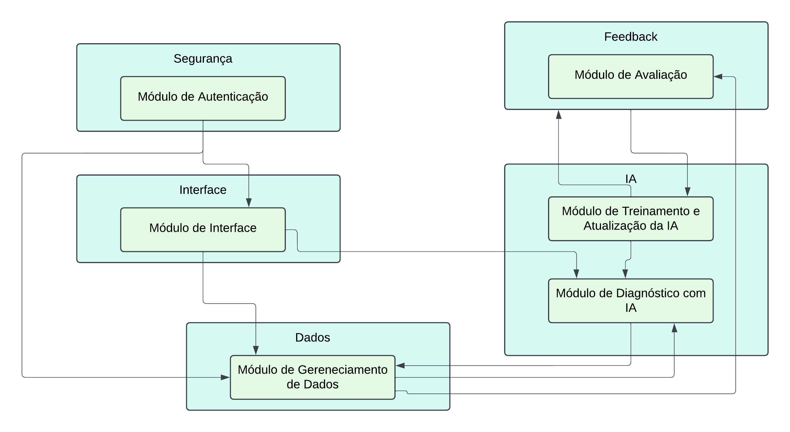

O sistema é subdividido nos **seguintes módulos:**

### Módulo de Autenticação

É responsável por gerenciar o acesso ao sistema, garantindo a segurança e exclusividade dos usuários autorizados. Ele permite funcionalidades como Login, Logout, Registro de novos usuários e Recuperação de senhas. Além disso, esse módulo controla permissões de acesso, assegurando que cada usuário possa acessar apenas os recursos apropriados ao seu perfil.

### Módulo de Interface do Usuário

É responsável por apresentar a interface gráfica e gerenciar a interação direta com o usuário. Ele solicita atualizações ao Módulo de Gerenciamento de Dados, processa as informações recebidas e as exibe de maneira organizada e adaptada às permissões do usuário. Esse módulo assegura uma experiência intuitiva e personalizada, facilitando o uso do sistema.

### Módulo de Diagnóstico com IA

É responsável por analisar imagens enviadas pelos usuários para reconhecer as possíveis doenças das plantas. Ele processa as fotos utilizando modelos de IA, gerando diagnósticos precisos e oferecendo recomendações baseadas nos resultados.

### Módulo de Gerenciamento de Dados

É responsável por organizar e exibir as imagens enviadas pelos usuários, além de manter o histórico de diagnósticos associados. Ele permite visualizar e gerenciar as fotos armazenadas, possibilitando acesso fácil a informações de diagnósticos anteriores.

### Módulo de Avaliação

É responsável por coletar e gerenciar o feedback fornecido pelos usuários sobre os diagnósticos gerados pela IA. Esse módulo permite que os usuários com as permissões de acesso devidas avaliem a precisão dos resultados apresentados, indicando se os diagnósticos foram úteis ou corretos. As informações coletadas são enviadas para o Módulo de Treinamento e Atualização da IA

### Módulo de Treinamento e Atualização da IA

É responsável por aprimorar continuamente os modelos de IA do sistema. Ele permite integrar novas imagens e atualizar o modelo em produção. Esse módulo garante que o sistema permaneça eficiente e confiável à medida que novos dados são incorporados.

O diagrama a seguir ilustra a arquitetura modular do nosso sistema. Através dele, é possível visualizar como os seis módulos se comunicam e trabalham em conjunto para oferecer o serviço:

{: .imagem }

**
Figura 8** - Diagrama de módulos - Fonte: Elaboração Própria (2024)

#### Diagrama de Classes da aplicação

{: .imagem }

**
Figura 9** - Diagrama de Classes de aplicação - Fonte: Elaboração Própria (2024)

O diagrama de classes, apresentado na figura 9, demonstra como os principais componentes do sistema interagem para realizar as funcionalidades do "Cuidar Verde". A classe Usuário desempenha um papel central, conectando-se com o histórico de diagnósticos, que armazena as fotos e os resultados processados pela IA. A classe Planta garante que as análises estejam associadas a espécies específicas, enquanto a classe Foto gerencia as imagens fornecidas.

A IA funciona como a inteligência central, recebendo as imagens, processando os diagnósticos e enviando os resultados para o Diagnóstico, que por sua vez é persistido no Histórico.

O sistema promove uma arquitetura coesa e modular, permitindo a expansão futura com novas plantas, funcionalidades ou modelos de IA.

No diagrama apresentado, as cardinalidades representam a relação entre as classes e como elas se conectam. As cardinalidades são indicadas da seguinte forma:

**1:1** (Um para Um): Uma instância de uma classe se relaciona diretamente com uma única instância de outra classe.
**1:N** (Um para Muitos): Uma instância de uma classe pode se relacionar com múltiplas instâncias de outra classe.

#### Análise das Cardinalidades no Diagrama

Usuario ↔ Historico
Cardinalidade: 1:N

Explicação: Um único usuário pode ter múltiplos registros no histórico de diagnósticos, mas cada registro no histórico pertence a apenas um usuário. Exemplo: Um agricultor (usuário) pode consultar várias plantas e salvar diagnósticos em diferentes momentos, gerando múltiplos registros no histórico.

Histórico ↔ Diagnóstico
Cardinalidade: 1:1

Explicação: Cada registro no histórico está diretamente associado a um único diagnóstico. Um diagnóstico específico gera um único registro no histórico. Exemplo: O histórico de uma planta inclui os detalhes de apenas um diagnóstico feito pela IA.

Diagnostico ↔ Foto
Cardinalidade: 1:1

Explicação: Cada diagnóstico está relacionado a uma única foto. Isso significa que uma imagem enviada pelo usuário será processada pela IA e terá um único resultado de diagnóstico. Exemplo: O usuário tira uma foto específica da planta, que gera um único diagnóstico de doença.

Foto ↔ Planta
Cardinalidade: 1:1

Explicação: Cada foto enviada está vinculada a apenas uma planta selecionada pelo usuário no sistema. Exemplo: Uma foto da folha de um tomateiro será relacionada exclusivamente à planta "Tomate".

Diagnóstico ↔ IA
Cardinalidade: 1:1

Explicação: O modelo de IA processa uma única imagem para fornecer um diagnóstico. Cada diagnóstico é gerado a partir de uma única execução da IA. Exemplo: Uma imagem é enviada à IA, que analisa e retorna um diagnóstico específico.

#### Explicação das Informações nas Classes

O sistema "Cuidar Verde" foi cuidadosamente projetado para estruturar suas funcionalidades de maneira eficiente, permitindo a implementação de um fluxo prático e robusto para os usuários finais. Abaixo, explico como cada classe e suas respectivas listas de atributos e métodos contribuem diretamente para a prática do software:

A **classe Usuário** desempenha um papel essencial na identificação e autenticação dos usuários do sistema, sendo eles agricultores ou agrônomos. Através dos atributos como id, nome, email e senha, o sistema garante que cada usuário tenha acesso seguro e individualizado à plataforma. O atributo **CREA** diferencia os agrônomos, validando suas credenciais profissionais com o método **validarCREA()**, garantindo a confiabilidade do feedback dado por esses profissionais. Métodos como **login()** e **cadastro()** facilitam o acesso ao sistema e a inclusão de novos usuários, assegurando que somente pessoas autorizadas possam interagir com as funcionalidades principais. O método **acessarPerfil()** permite que os usuários mantenham seus dados atualizados, personalizando a experiência na plataforma.

A classe **IA** é o coração do sistema, responsável pela análise das imagens e geração dos diagnósticos. Com atributos como **modelo** e **confianca**, o software torna visível a capacidade da IA em fornecer diagnósticos confiáveis, um aspecto crucial para a tomada de decisões dos agricultores. O método **diagnosticar()** realiza a análise prática das fotos enviadas pelos usuários e, junto ao método **treinar()**, permite a contínua evolução e aperfeiçoamento do modelo de IA. Isso torna o sistema dinâmico, aumentando a precisão ao longo do tempo conforme novos feedbacks são recebidos e incorporados.

A classe **Planta** organiza e gerencia as espécies de plantas suportadas pelo sistema. Seus atributos como **id, nome** e **descricao** garantem que cada planta cadastrada seja facilmente identificável. O método **selecionar()** contribui diretamente para a prática do software, pois permite ao usuário escolher a planta específica que será diagnosticada, agilizando o fluxo de trabalho e evitando erros durante o envio de fotos. Essa organização é essencial para a eficácia da identificação e melhora a experiência do usuário.

A classe **Foto** facilita o envio das imagens, sendo uma ponte direta entre o usuário e a IA. Através dos atributos caminho e origem, o software identifica e processa corretamente a imagem enviada. O método **capturar()** possibilita que o usuário tire uma nova foto no momento, enquanto o **upload()** permite selecionar uma imagem existente na galeria. Esses métodos são fundamentais para tornar o sistema mais flexível e acessível, pois atendem diferentes situações de uso, como tirar fotos no campo ou carregar imagens pré-capturadas.

A classe **Diagnóstico** conecta o processamento da IA com a entrega do resultado ao usuário. Atributos como resultado são utilizados para informar claramente a doença diagnosticada, como "Mancha Preta" ou "Ferrugem". Métodos como **analisar()** integram diretamente com a IA para processar a imagem e gerar o diagnóstico, enquanto o **salvarHistorico()** registra esses resultados para referência futura. Essa prática possibilita que o agricultor tenha respostas rápidas e confiáveis, melhorando o manejo das suas plantações.

Por fim, a classe **Histórica** organiza os diagnósticos realizados, permitindo a construção de um registro completo e acessível para cada usuário. Atributos como **dataAvaliacao** e **plantaId** facilitam a identificação dos diagnósticos anteriores, enquanto o método **listarUltimas()** fornece ao usuário uma visão clara das análises mais recentes. Essa funcionalidade prática ajuda os agricultores a acompanhar a evolução da saúde de suas plantações, permitindo decisões informadas e estratégicas no manejo das doenças.

Em resumo, cada classe e seus métodos foram planejados para contribuir de forma direta e prática ao funcionamento do software. A classe **Usuario** cuida do controle de acesso e personalização da experiência. A IA garante a análise inteligente e precisa das imagens enviadas. A classe Planta organiza o cadastro das espécies suportadas, enquanto a Foto facilita o envio das imagens essenciais para diagnóstico. A classe **Diagnostico** conecta o processamento e a entrega dos resultados, e a classe **Historico** armazena os dados analisados, oferecendo transparência e acompanhamento contínuo. Todas essas classes trabalham em conjunto para fornecer um sistema intuitivo, eficiente e extremamente útil para agricultores e agrônomos, promovendo melhorias na produtividade e na saúde das plantações.

#### Diagrama de Atividades da aplicação

{: .imagem }

**
Figura 10** - Diagrama de Atividades da aplicação - Fonte: Elaboração Própria (2024)

O Diagrama de Atividades representa o fluxo completo de execução das principais ações do sistema Cuidar Verde, detalhando cada etapa desde a entrada do usuário até o processamento e feedback para melhoria da IA. Abaixo está uma descrição das principais atividades, suas transições e como os elementos se relacionam no fluxo. Segue as atividades principais do diagrama explicadas:

**1. Login do Usuário**

- Descrição: O usuário realiza a autenticação no sistema informando e-mail e senha.
- Ator: Agricultor ou Agrônomo.
- Transição: Após a validação, direciona o usuário ao menu principal.
- Condição: Caso falhe, exibe uma mensagem de erro e permite a tentativa de recuperação de senha.

**2. Seleção da Planta**

- Descrição: O usuário seleciona a planta desejada para análise no sistema.
- Atributos: Planta selecionada (ex.: Tomate, Soja, Banana, etc.).
- Transição: Encaminha o usuário para a próxima atividade: captura ou envio de imagem.

**3. Envio da Imagem**

- Descrição: O usuário tem duas opções:
- Tirar uma foto usando a câmera do dispositivo.
- Fazer o upload de uma foto existente no celular.
- Condição: A imagem deve passar por pré-validação, garantindo qualidade mínima.
- Atributos: Imagem (tamanho, resolução, qualidade).

**4. Processamento da Imagem pela IA**

- Descrição: A imagem é enviada para a API e, posteriormente, processada pela IA.
- Atributos: Modelo treinado (TensorFlow), dataset referenciado (PlantVillage).
- Transição: A IA analisa a imagem e identifica a doença, retornando os resultados.
- Condição: Se a análise falhar ou a imagem for inválida, o sistema solicita nova imagem.

**5. Apresentação do Diagnóstico**

- Descrição: O diagnóstico é exibido ao usuário.
- Atributos: Nome da doença, descrição e possíveis causas.
- Transição: Usuário pode enviar um feedback sobre o diagnóstico.

**6. Feedback do Usuário**

- Descrição: O Agrônomo pode validar se o diagnóstico foi correto (Botão “Certo” ou “Errado”).
- Atributos: Feedback (positivo ou negativo).
- Transição: O feedback é armazenado e utilizado para reajustar a IA.

**7. Atualização do Histórico**

- Descrição: O sistema salva o diagnóstico no histórico do usuário, permitindo consultas futuras.
- Atributos: Histórico de diagnósticos (data, planta, imagem analisada, resultado).

**8. Reajuste da IA**

- Descrição: O feedback armazenado alimenta a IA para treinar e otimizar os resultados.
- Atributos: Feedback acumulado, dados do diagnóstico.
- Transição: Finaliza o processo

**9. Redirecionamento para a Tela Inicial**

- Descrição: Após todos os passos e processamentos da IA, o Usuário será redirecionado para a tela de inicial

#### Diagrama de Estados da aplicação

{: .imagem }

**
Figura 11** - Diagrama de Estados da aplicação - Fonte: Elaboração Própria (2024)

