# Relatório de testagem Caso de Teste 21 16022025

## Introdução

## **Informações preliminares**

- Testador: Ryan Augusto Brandão Salles
- Matrícula: 221008436
- Ambiente de Testes: Google Colab
- Data de Realização dos testes: 15/02/2025
- Arquitetura testada: LSX_v2

## **Definições preliminares**

Nessa seção, serão definidas as terminologias utilizadas nesse documento.

## **Conjunto de Dados**

O conjunto de dados, para os fins da testagem descrita nesse documento será um
conjunto de imagens que não foi utilizado para o treinamento do modelo. Para cada label
reportada como suportada pelo modelo, deverá haver no mínimo 10 imagens.

Caso um conjunto de dados próprio para testagem não esteja disponível, será
necessário realizar um treinamento completo separando uma parte do conjunto de
treinamento para validação e outra parte para testagem (“evaluation”), totalizando três
partes.
Nesse caso, o script de testagem será o mesmo utilizado no treinamento.

## **Label suportada**

Label é uma categoria de imagem considerada passível de output pelo modelo. Caso o modelo tenha realizado treinamento para essa label e tenha reportado uma acurácia
sob especificação, a label será considerada suportada e será passível de testagem.

## **Cobertura**

Será considerado parte da cobertura do modelo as labels que, após a testagem
descrita nesse documento, atingirem uma taxa de acerto de ao menos 85%. Dado que o mínimo para cada teste será

## **Unidade de Treinamento Padrão (UTP) Virgo**

O treinamento de modelos gerados ao longo do projeto virgo utiliza A Unidade de
Treinamento Padrão: 100 épocas de 150 batches de 8 imagens, totalizando 120 mil
imagens processadas para o treinamento de um modelo.

## **Modelo**

É considerado um **Modelo válido para testagem** todo o modelo que, dado uma
UTP atingiu, pelo menos, 85% de acurácia após o treinamento com o script de treinamento.
Caso o modelo não seja capaz de atingir esse mínimo após a UTP, ele deve ser descartado
e seu script de treinamento deve ser modificado.

## **Objetivos**

- Avaliar cobertura e acurácia da arquitetura modelo resultante do treinamento

## **Escopo dos testes**

- Todas as labels suportadas pelo modelo de testes, sendo, portanto as labels presentes no dataset le_dataset, exceto as seguintes:
- alface_oidio
- alface_podridao_basal
- banana_cordana
- banana_pestalotiopsis
- banana_sigatoka_fungo
- mandioca_acaro
- mandioca_antracnose
- mandioca_bacteriose
- mandioca_mancha_parda
- mandioca_mancha_branca
- mandioca_mosaico_comum
- mandioca_mosaico_nervuras
- mandioca_mosca_galhas
- mandioca_oidio
- mandioca_podridao
- mandioca_queima_das_folhas
- mandioca_saudavel
- soja_ferrugem
- soja_mancha_bacteriana
- soja_mancha_parda
- soja_murcha_do_sul
- soja_septoria
- soja_mosaico

  As labels listadas como excluídas não passaram por treinamento e, portanto, não são
  suportadas.

## **Ferramentas de Teste**

- Conjunto de Dados padronizado
- Script de treinamento e testagem mais recente
- Arquitetura mais recente

## **Passos (em caso de presença de um conjunto de dados para testagem disponível)**

**1. Carregar script de testagem mais recente no google colab**

**2. Configurar ambiente de execução para utilizar o tipo de ambiente “CPU”**

**3. Rodar e aguardar o término do script de testagem. O script irá:**

- a. Carregar modelo utilizado pelo aplicativo

- b. Carregar arquivos de testagem

- c. Carregar framework de rodagem do modelo (TensorFlow)

- d. Realizar testagem para cada Conjunto de Dados padronizado

- e. Para cada teste, será considerado um acerto se a resposta do modelo condizer com a imagem dada como input e erro

**Avaliar métricas resultantes**

- a. A taxa de acerto mínima para aceitação será de 85%. Considerando que o teste mínimo é de 10 imagens, 9 de cada 10 imagens devem ter respostas corretas.

## **Passos (em caso de conjunto de dados próprio para testagem faltante)**

**1. Carregar o script de treinamento mais recente utilizando no google colab**

**2. Configurar o ambiente de execução para utilizar o tipo de ambiente “GPUs: T4”**

**3. Rodar e aguardar o término do script de treinamento e testagem. O script irá:**

- a. Carregar dataset le_dataset

- b. Carregar módulos do dataset mais recentes

- c. Formatar dataset para reconhecimento pelo TensorFlow

- d. Carregar framework de rodagem do modelo (TensorFlow)

- e. Separar dataset em três partes: treinamento, validação e testagem

- f. Realizar treinamento para uma UTP

- g. Realizar testagem

- h. Gerar métricas

**4. Avaliar métricas resultantes**

## **Critérios de aceitação - caso de conjunto de dados próprio para testagem**

### Aceitação parcial:

- O modelo atende à taxa de especificação para somente parte das labels suportadas

### Aceitação total:

- O modelo atende à taxa de especificação para todas as labels suportadas

## **Critérios de aceitação - caso de conjunto de dados le_dataset**

### Aceitação total:

- O modelo atende à taxa de acurácia de especificação.

## **Caso de aceitação parcial ou não aceitação**

Essa seção descreve o que deve ser feito em caso de não aceitação do modelo ou aceitação parcial. Ambos os modelos resultantes desses casos deverão passar novamente por esse Caso de Teste.

### Aceitação parcial:

- O modelo deve passar por processo de reciclagem por um Conjunto de Dados que atenda às labels recusadas pelo teste. O modelo atualizado deverá substituir o
  modelo antigo recusado parcialmente no repositório.

- Caso 90% ou mais das labels suportadas pelo modelo sejam rejeitadas, o modelo será considerado completamente não aceito.

### Não Aceitação:

- O modelo será rejeitado e deverá ser refeito e atualizado no repositório, substituindo
  o modelo rejeitado.

- O modelo terá a chance de aumentar sua acurácia enquanto o tempo limite de
  rodagem permitir.

## **Resultados**

### **Rodagem I**

- Dataset utilizado: le_dataset_v1_4_1

- Ambiente de testes: Google Colab configurado para rodar na GPU T4.

- Tempo total de treinamento: cerca de 2 horas.

- Modelo atingiu .87 de acurácia durante última época do treinamento.

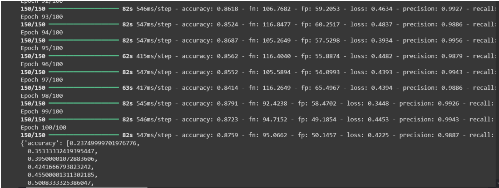

**
Imagem 1**- Métricas LSX_v2

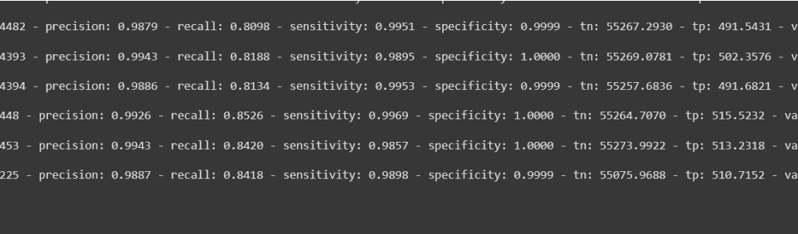

**
Imagem 2**- Métricas LSX_v2

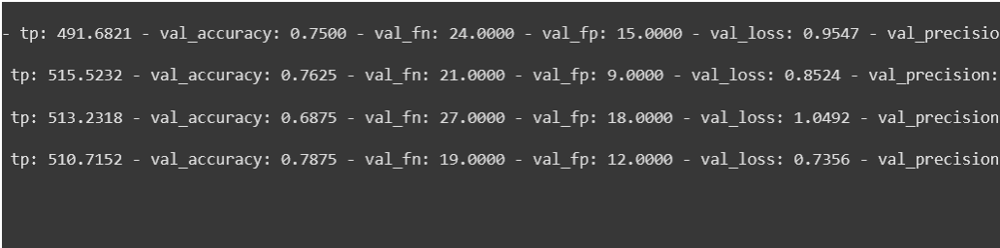

**
Imagem 3**- Métricas LSX_v2

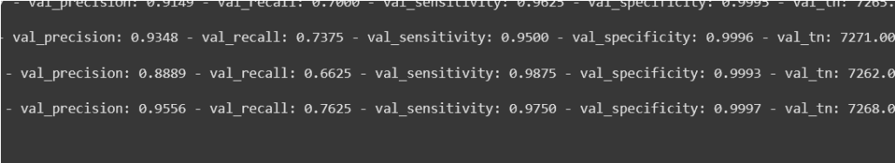

**
Imagem 4**- Métricas LSX_v2

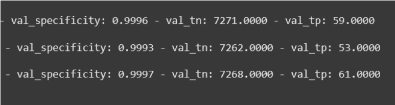

**
Imagem 5**- Métricas LSX_v2

- Modelo reportou as seguintes métricas em média:

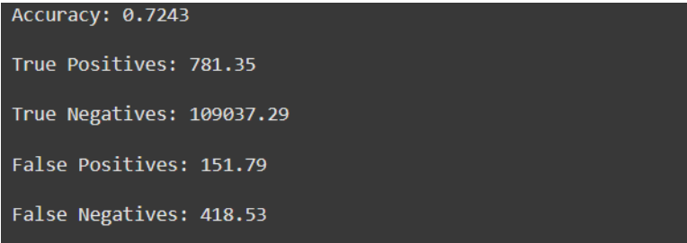

**
Imagem 6**- Métricas LSX_v2

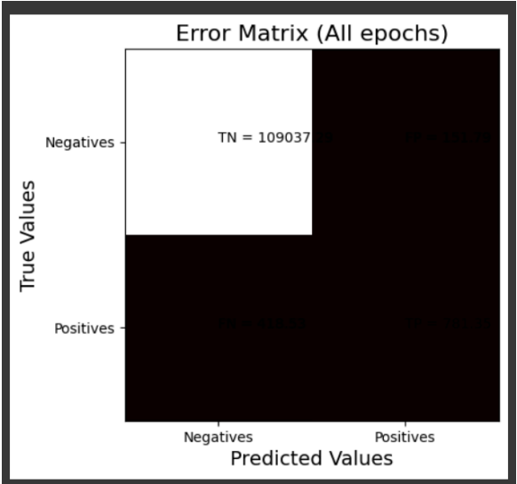

**
Gráfico 1**- Métricas LSX_v2

- Modelo reportou .76 de acurácia durante evaluation

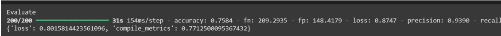

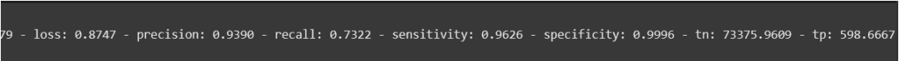

**
Imagens 7 e 8**- Métricas LSX_v2

### **Rodagem II**

Para acoplar às restrições do ambiente de testes, nessa rodagem, o modelo foi configurado
para rodar por apenas meia UTP, continuando o treinamento realizado na rodagem I.

- Dataset utilizado: le_dataset_v1_4_1
- Ambiente de testes: Google Colab configurado para rodar no ambiente GPU T4
- A segunda rodagem foi interrompida antecipadamente por razões de restrição de
  tempo do Google Colab
- O modelo reportou .91 de acurácia em sua última época rodada completamente:

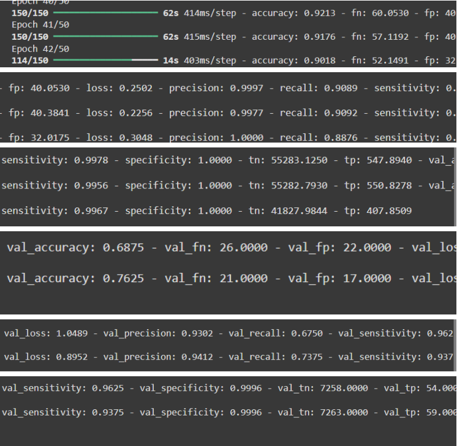

**
Imagem 9**- Métricas LSX_v2

- As métricas médias não foram atualizadas devido à parada abrupta
- O modelo reportou .72 de acurácia após o evaluation

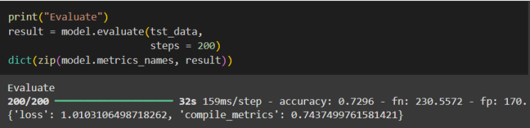

**
Imagem 10**- Métricas LSX_v2

- Aumentar o número de passos no evaluation rendeu um leve percentual maior

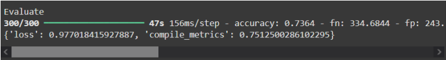

**
Imagem 11**- Métricas LSX_v2

## **Notas adicionais**

A rodagem foi atrasada por 2 erros fatais na geração dos caches de
pré-processamento do dataset. Após a resolução desses erros, foi gerada a revisão
v1.4.1 do dataset:

**1.** Haviam alguns .ini escondidos em labels como alface_saudavel. Após abrir o
dataset utilizando o 7z file manager, foi possível encontrá-los.

**2.** Um dos jpgs estava corrompido. Após a exclusão desse, o tensorflow foi
capaz de realizar o cache do dataset. O arquivo corrompido fazia parte da
label de deficiência de potássio da soja.

**3.** Ademais, o le_dataset passou a consumir pouco mais de meio GB após um
esforço de processar as imagens para armazenamento levando em conta que o modelo não enxerga mais detalhes que 256x256 pixels.

O consumo de RAM da GPU estava perigosamente proximo de um crash ao longo
de todo o treinamento. O modelo foi capaz de realizar o treinamento nessas
condições, não obstante.

## **Conclusão**

O modelo, para as métricas apresentadas em treinamento, está sob e acíma da
especificação. O modelo, todavia apresenta evaluation abaixo do esperado para o
treinamento. Pode ser necessário refazer parte da arquitetura ou desativar labels de
qualidade baixa para obter valores mais satisfatórios.

No mais, o modelo demonstrou acurácia acíma de .85 durante treinamento e passos
de validação, sendo **aprovado.**
