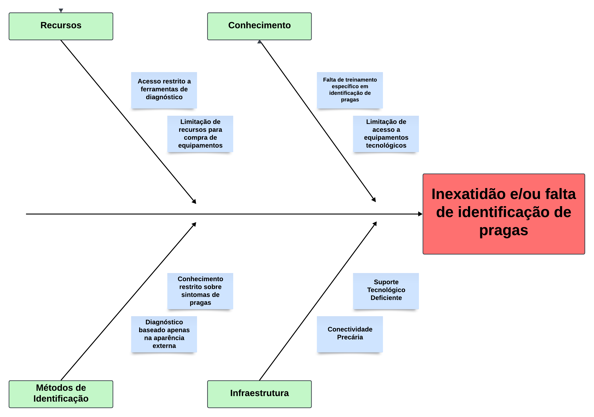

# Visão Geral do Produto

## Problema

A falta de precisão na identificação de pragas nas plantações dos pequenos agricultores representa um problema complexo, com impactos significativos na produção e na sustentabilidade econômica.

Muitos desses produtores enfrentam limitações financeiras e dificuldade de acesso a tecnologias avançadas, como sistemas de monitoramento digital ou serviços de assistência técnica especializada. Como resultado, dependem de observações visuais, muitas vezes imprecisas, para diagnosticar pragas, o que pode levar à aplicação de tratamentos inadequados e ineficazes, comprometendo tanto a saúde das plantas quanto o equilíbrio ambiental.

Figura 01: Diagrama Ishikawa - Dificuldades de pequenos e médios agricultores no diagnóstico de pragas.

Fonte: Elaboração própria (2024)

Conforme ilustrado na Figura 01, os principais fatores que dificultam a identificação de pragas incluem a falta de recursos financeiros, conhecimento técnico, métodos adequados e infraestrutura tecnológica. Essa análise evidencia que o uso de ferramentas acessíveis, como aplicativos móveis, pode ser um caminho viável para enfrentar essas limitações.

Para resolver essa questão, propomos o desenvolvimento do aplicativo móvel **Cuidar Verde**, que será projetado para utilizar inteligência artificial a fim de identificar pragas de forma rápida e precisa. O aplicativo está sendo concebido para operar em smartphones, considerando sua ampla disponibilidade entre agricultores e a praticidade que oferece para capturar imagens diretamente no campo. A escolha da inteligência artificial está baseada em sua capacidade de analisar padrões em imagens e fornecer diagnósticos de maneira mais simples, afim de auxiliar aqueles que não tem o conhecimento devido para diagnosticar a doença de uma planta

Esse aplicativo não só facilitará o manejo das doenças como contribuirá para a educação contínua dos agricultores, promovendo práticas agrícolas mais eficientes e ambientalmente responsáveis.

## Declaração de Posição do Produto

| Para:           | Pequenos e médios agricultores                                                                                                                                                                                           |
| --------------- | ------------------------------------------------------------------------------------------------------------------------------------------------------------------------------------------------------------------------ |
| Necessidade:    | A falta de precisão na identificação e diagnóstico de pragas                                                                                                                                                             |
| O Cuidar Verde: | É um **Aplicativo Mobile** que identifica as pragas das plantas por meio de fotos tiradas pelo usuário.                                                                                                                  |
| Ao contrário:   | Observações visuais e tratamentos baseados em diagnósticos imprecisos, o que pode prejudicar a saúde das plantas e do meio ambiente. Se o produto não existir, o agricultor continuará dependendo de métodos imprecisos. |
| Nosso produto:  | Diferencia-se ao oferecer uma ferramenta portátil, leve e de fácil acesso baseada em inteligência artificial treinada que evolui de acordo com seu uso, podendo ser aprimorada gradualmente.                             |

**Quadro 1:** Proposta de Solução para Diagnóstico Preciso de Pragas com o Aplicativo Cuidar Verde

A Tabela 1 apresenta a proposta do aplicativo Cuidar Verde, uma solução inovadora para pequenos e médios agricultores. Ela descreve como o aplicativo oferece uma ferramenta precisa e acessível para a identificação de pragas nas plantas, substituindo métodos tradicionais que podem ser imprecisos e potencialmente prejudiciais.

## Objetivos do Produto

O objetivo deste software é auxiliar pequenos e médios agricultores no diagnóstico e manejo de doenças nas plantas, utilizando tecnologias de inteligência artificial para análise de imagens e reconhecimento de doenças.

Agricultores frequentemente enfrentam dificuldades em identificar doenças rapidamente, o que pode resultar em perda de produtividade e aumento de custos com defensivos agrícolas inadequados.

Nosso objetivo é aprimorar a agricultura familiar utilizando inteligência artificial para identificar doenças em plantações, com foco específico na região do DF / Brazlândia.

## Tecnologias a Serem Utilizadas

O projeto Virgo utilizará das seguintes tecnologias:

- **Figma:** ferramenta de design online e colaborativa que permite criar interfaces, protótipos e wireframes, permitindo prototipagem da front-end antes de execução. para elaborar
- **Expo & Expo Go:** (Plataforma open-source para desenvolver aplicativos mobile Android e IOS que usa a biblioteca REACT NATIVE ): para criar e estruturar o aplicativo mobile
- **TensorFlow:** biblioteca que permite a criação de modelos de rede neural para posterior treinamento.
- **Google Collab:** plataforma de computação em nuvem focada em treinamento de redes neurais.
- **NestJS:** framework back-end para servidores que executam o Node.js
- **PostgreSQL:** ferramenta que atua como sistema de gerenciamento de bancos de dados relacionais.
