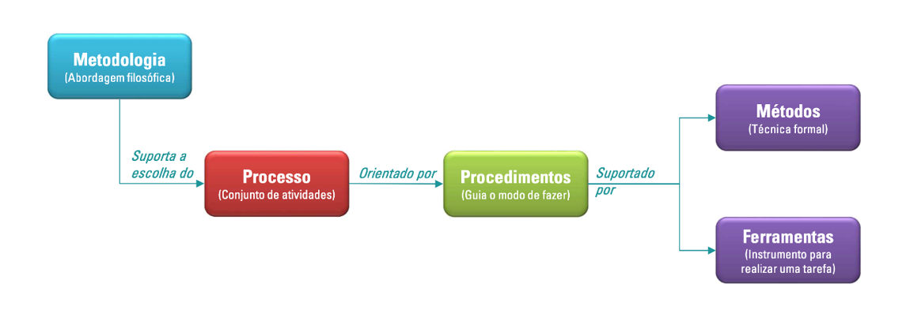

# Visão Geral do Projeto

## Ciclo de vida do projeto de desenvolvimento de software

A imagem abaixo oferece uma visão simplificada, mas abrangente, dos elementos que compõem um processo de desenvolvimento de software:

**Imagem 1:** Processo de desenvolvimento de software -
**Fonte:** Imagem disponibilizada no material do Professor. Elaboração: Professor Ajax (2024).

### **Metodologia**

A metodologia escolhida para o desenvolvimento do aplicativo é a Ágil, com o framework Scrum. Essa abordagem foi selecionada devido à sua flexibilidade e à capacidade de se adaptar a mudanças frequentes durante o projeto, características fundamentais no desenvolvimento de um aplicativo que utiliza inteligência artificial. O Scrum, em particular, organiza o trabalho em ciclos curtos e bem definidos chamados sprints, permitindo entregas incrementais de valor e possibilitando a validação contínua de funcionalidades por meio do feedback dos usuários e do cliente.

Além disso, a metodologia adotada para o desenvolvimento do aplicativo integra práticas como revisão de código, testes unitários, pair programming e revisões regulares. O pair programming e as revisões regulares garantem a troca contínua de conhecimentos entre os membros da equipe e a identificação precoce de problemas. A revisão de código permite que o código seja constantemente avaliado e otimizado, enquanto os testes unitários asseguram a qualidade do produto ao longo de todo o desenvolvimento.

Essa metodologia proporciona um ambiente colaborativo e iterativo, essencial para a integração das diversas áreas do projeto. Sua escolha suporta a definição do processo, fornecendo a base filosófica e organizacional necessária para estruturar e guiar as atividades de forma eficiente e orientada a resultados.

### **Processo**

O processo definido para o desenvolvimento do aplicativo segue um esboço geral estruturado em etapas, organizadas por sprints. Cada sprint engloba atividades como planejamento, desenvolvimento, testes e entregas incrementais. Esse processo permite o desenvolvimento iterativo, no qual cada etapa contribui para a construção de funcionalidades específicas e testáveis.

A escolha desse processo está alinhada com a necessidade de entregar resultados frequentes e utilizáveis, garantindo que o aplicativo evolua com base no feedback de usuários reais, como os pequenos agricultores de Brazlândia. Essa abordagem garante uma adaptação contínua às necessidades identificadas, além de promover uma execução eficiente do projeto. O processo é orientado por procedimentos claros que detalham como cada tarefa deve ser realizada.

### **Procedimentos**

Os procedimentos definidos para o projeto garantem que cada etapa do desenvolvimento seja executada de forma eficiente e padronizada. A revisão de código será realizada por pelo menos dois desenvolvedores a cada pull request no GitHub, utilizando um checklist padronizado de verificação, promovendo um controle de qualidade contínuo. \*Testes unitários serão implementados no back-end, cobrindo todos os componentes críticos da aplicação, com meta mínima de 80% de cobertura de código, para garantir que a lógica da aplicação esteja funcionando corretamente. O modelo de IA será validado regularmente através de métricas quantitativas (como precisão, recall e F1-score) e avaliações qualitativas dos resultados, com testes em diferentes cenários de uso para garantir sua precisão e eficácia.

### **Métodos**

O principal método utilizado no desenvolvimento será o treinamento de um modelo de inteligência artificial com redes neurais convolucionais (CNN). A CNN é um tipo de rede neural projetada para processar dados estruturados em forma de grades. Ela utiliza três camadas:

- **Camada de Convolução**:
- Usa filtros para detectar padrões em diferentes partes da imagem.
- **Camada de Pooling**:
- Reduz a dimensão dos dados e mantém as informações principais, o que melhora a eficiência do modelo
- **Camadas Conectadas**:
- Ela pegam os padrões detectados e os tranformam em previsões.

Esse tipo de rede é particularmente eficiente na classificação de imagens e é amplamente utilizado em problemas de visão computacional. O treinamento do modelo será realizado com dados supervisionados, utilizando uma base de imagens rotuladas que representam tanto plantas saudáveis quanto plantas com doenças específicas. Cada planta terá seu dataset fornecido pela plataforma kaggle.

### **Ferramentas**

As ferramentas utilizadas no projeto foram escolhidas de forma a atender tanto às necessidades técnicas quanto aos objetivos do aplicativo. No back-end, será utilizado o Nest.js como framework principal, garantindo uma estrutura escalável e organizada para o desenvolvimento da API. O Prisma ORM será usado para facilitar o gerenciamento e a comunicação com o banco de dados PostgreSQL, que armazenará as informações de diagnósticos e usuários.

No front-end, o React Native será usado para criar uma interface nativa e responsiva, enquanto o Expo simplificará o desenvolvimento e o teste do aplicativo em dispositivos móveis. Para o treinamento do modelo de inteligência artificial, serão utilizadas as bibliotecas TensorFlow e Python Image Library, permitindo a manipulação eficiente de imagens e a implementação das redes neurais convolucionais. Essas ferramentas, combinadas, garantem que o projeto seja executado com eficiência, desde o desenvolvimento inicial até a entrega final do aplicativo.

O GitHub será a principal ferramenta de versionamento de código e colaboração. Ele será utilizado para armazenar e gerenciar o repositório do projeto, realizar controle de versionamento e implementar fluxos de trabalho como o GitHub Flow. Além disso, o GitHub será fundamental para facilitar a revisão de código por meio de pull requests, promovendo a integração contínua e assegurando a qualidade do código em todas as etapas do desenvolvimento.

## Organização do Projeto

Nossa equipe vai adotar práticas colaborativas para garantir a eficiência e a qualidade do projeto. Vamos trabalhar com pair programming, onde dois integrantes atuam juntos no desenvolvimento, alternando entre quem escreve o código e quem revisa. Além disso, faremos trocas de pares a cada sprint, promovendo a troca de conhecimentos e fortalecendo o domínio coletivo sobre o sistema. Também teremos revisões regulares durante os ciclos de Scrum, garantindo que todos estejam alinhados e que as entregas atendam aos requisitos definidos.

O texto acima pode ser visualizado de forma mais clara no quadro abaixo, que detalha as atribuições e participantes de cada papel no desenvolvimento do aplicativo Cuidar Verde.

| Papel                         | Atribuições                                                                                                                                                                                                                                                                                              | Participantes                                                                                                    |
| ----------------------------- | -------------------------------------------------------------------------------------------------------------------------------------------------------------------------------------------------------------------------------------------------------------------------------------------------------- | ---------------------------------------------------------------------------------------------------------------- |
| Desenvolvedores               | Será responsável por criar as funcionalidades principais do aplicativo, como cadastro, login, histórico de doenças e envio de fotos, além de integrar a inteligência artificial com o app. A ideia é que o aplicativo seja simples, funcional e acessível para o público-alvo.                           | Arthur Leite, Gabriel Dantas, João Lobo, Kauan, Leonardo, Lucas, Maria Eduarda, Pedro Camilo, Renan, Ryan Salles |
| Scrum Master                  | Organizar as tarefas e resolver qualquer problema que surgir durante o desenvolvimento. Ele vai cuidar para que as entregas sejam feitas aos poucos, de forma organizada e dentro dos prazos.                                                                                                            | João Lobo                                                                                                        |
| Analista de Qualidade Interna | Garantir que tudo o que vai ser entregue funcione como esperado e que o app seja fácil de usar. Ele vai testar as funcionalidades e dar feedback para o time melhorar o que for necessário.                                                                                                              | João Lobo                                                                                                        |
| Analista de Qualidade Externa | Terá o papel de garantir que tudo o que será entregue funcione como esperado e que o aplicativo seja intuitivo para os usuários finais. Ele vai testar as funcionalidades em um contexto mais próximo da experiência real do cliente, dando feedback valioso ao time para melhorar o que for necessário. | Wildemberg Sales                                                                                                 |
| Cliente                       | Vai representar o público-alvo e validar o projeto, ajudando a equipe a entender as necessidades reais dos agricultores e ajustando o aplicativo conforme necessário.                                                                                                                                    | Wildemberg Sales                                                                                                 |
| Desenvolvedores da IA         | Treinar a inteligência artificial que vai identificar as pragas e doenças nas plantas. Eles também vão trabalhar no pré-processamento das imagens enviadas pelos usuários, para garantir que a IA funcione bem, e buscar atingir pelo menos 85% de acerto.                                               | Arthur Leite, Gabriel Dantas, João Lobo, Kauan, Maria Eduarda, Pedro Camilo, Renan, Ryan Salles                  |

**Quadro 2:** Detalhamento do papel e das atribuições dos integrantes da equipe.
Fonte: Elaboração própria (2024).

## Planejamento das Fases e/ou Iterações do Projeto

O quadro abaixo tem como objetivo mostrar o planejamento da equipe em relação às entregas do projeto, detalhando as fases e/ou iterações previstas ao longo do desenvolvimento.

| Sprint    | Produto (Entrega)                                                                                                                                                                                      | Data Início | Data Fim   | Entregável(eis)                                                                                                                                                                                                                                                                                                                                      |
| --------- | ------------------------------------------------------------------------------------------------------------------------------------------------------------------------------------------------------ | ----------- | ---------- | ---------------------------------------------------------------------------------------------------------------------------------------------------------------------------------------------------------------------------------------------------------------------------------------------------------------------------------------------------- |
| Sprint 1  | Definição do Produto                                                                                                                                                                                   | 19/11/2024  | 26/11/2024 | Fechamento dos Requisitos, Escopo Definido, Prioridades estabelecidas, e Plano inicial do projeto.                                                                                                                                                                                                                                                   |
| Sprint 2  | MVP e Planejamento do Projeto                                                                                                                                                                          | 26/11/2024  | 03/12/2024 | Documento inicial do projeto contendo a visão do produto, escopo preliminar e requisitos levantados, além da definição do MVP e planejamento de sprints do projeto.                                                                                                                                                                                  |
| Sprint 3  | Login / Cadastro / Recuperação de senha / Coleta e Preparo de Dados / Início do desenvolvimento da IA                                                                                                  | 03/12/2024  | 10/12/2024 | Login / Cadastro / Recuperação de senha, Back e Front prontos para serem integrados. Fase inicial de desenvolvimento e treinamento da IA.                                                                                                                                                                                                            |
| Sprint 4  | Teste e integração - Login / Cadastro / Recuperação de senha / Treinamento e Teste                                                                                                                     | 10/12/2024  | 17/12/2024 | Protótipo funcional da IA com modelo inicial treinado, Login, cadastro e recuperação de senha totalmente funcionais.                                                                                                                                                                                                                                 |
| Sprint 5  | Selecionar a planta / Instrução de como tirar foto / Tirar foto da planta / Identificar a doença (% de acerto fora do ideal) / Identificar a doença da planta utilizando uma foto existente no celular | 17/12/2024  | 23/12/2024 | Selecionar a planta implementado, Instrução de como tirar foto, implementação de Identificar a doença, da planta baseada da IA longe da meta de acerto definida, Indicação de não ter planta na foto / foto ruim (Identificar a doença da planta utilizando uma foto existente no celular implementado, mas o modelo não está totalmente funcional). |
| Sprint 6  | Identificação que não tem planta na foto, foto ruim / Feedback positivo, ou negativo (Agrônomo) / Instrução de como tirar foto / Histórico de plantas                                                  | 23/12/2024  | 03/01/2025 | Botões funcionais para o agrônomo dar feedback implementados. Sistema que identifica um problema na foto retirada, Histórico de plantas integrado e como Tirar foto depois de selecionar a Planta.                                                                                                                                                   |
| Sprint 7  | Identificação que não tem planta na foto, foto ruim (outros casos de uso) / Integração Histórico de plantas / Instrução de como tirar foto (outros casos de uso)                                       | 07/01/2025  | 14/01/2025 | Aumento dos casos que a IA identifica um problema na foto retirada, Histórico de plantas integrado, Melhoria na Instrução de como tirar foto.                                                                                                                                                                                                        |
| Sprint 8  | Diagnóstico de origem da contaminação da planta                                                                                                                                                        | 14/01/2025  | 21/01/2025 | Sistema de coleta de feedback funcionando, dados preparados para possíveis ajustes no modelo.                                                                                                                                                                                                                                                        |
| Sprint 9  | Aprimoramento e Integração Total                                                                                                                                                                       | 21/01/2025  | 28/01/2025 | IA integrada totalmente ao sistema, com usabilidade otimizada para o usuário final. Com percentual de acerto de no mínimo 85%.                                                                                                                                                                                                                       |
| Sprint 10 | Aprimoramento e Integração Total                                                                                                                                                                       | 28/01/2025  | 04/02/2025 | Sistema do produto pronto para testes finais, com desempenho e interfaces validadas.                                                                                                                                                                                                                                                                 |
| Sprint 11 | Testes finais e validação                                                                                                                                                                              | 04/02/2025  | 11/02/2025 | Relatório de testes compilado e sistema validado.                                                                                                                                                                                                                                                                                                    |
| Sprint 12 | Entrega final e revisão                                                                                                                                                                                | 11/02/2025  | 14/02/2025 | Versão final do produto pronta para entrega e apresentação.                                                                                                                                                                                                                                                                                          |

**Quadro 3:** Planejamento das Fases e/ou Iterações do Projeto.
Fonte: Elaboração própria (2024).

## Matriz de Comunicação

A tabela abaixo apresenta a Matriz de Comunicação, que descreve os processos de acompanhamento e comunicação das atividades do projeto, definindo a periodicidade, os produtos gerados e os canais utilizados para manter todos os envolvidos atualizados sobre o progresso, riscos e resultados do projeto.

| Descrição                                                             | Área/Envolvidos                       | Periodicidade | Produtos Gerados                                                                                                                             | Canal/Formato                       |
| --------------------------------------------------------------------- | ------------------------------------- | ------------- | -------------------------------------------------------------------------------------------------------------------------------------------- | ----------------------------------- |
| Acompanhamento das Atividades em Andamento                            | Equipe do Projeto                     | Semanal       | Ata de reunião Relatório de situação do projeto                                                                                           | Videoconferência via Teams          |
| Acompanhamento dos Riscos, Compromissos, Ações Pendentes, Indicadores | Equipe do Projeto Cliente          | Quinzenal     | Registro de riscos e planos de mitigação Listas de novos compromissos e decisões Relatórios indicadores, planos de correção e melhoria | Videoconferência via Teams          |
| Atualização da execução de cada atividade                             | Equipe do Projeto                     | Diário        | Registro de atividade                                                                                                                        | Mensagem de texto                   |
| Comunicar situação do projeto                                         | Equipe Prof/Monitor (Scrum Master) | Semanal       | Ata de reunião Relatório de situação do projeto                                                                                           | Presencialmente ou Videoconferência |

**Quadro 4:** Matriz de Comunicação.
Fonte: Elaboração própria (2024).

## Gerenciamento de Riscos

Abaixo estão registrados os riscos iniciais analisados após avaliação dos requisitos apresentados pelo cliente.

**Não entregar o projeto completo na data final (débito técnico)**

- **Risco:** O atraso na entrega do projeto pode ocorrer devido a falta de recursos, imprevistos ou desafios técnicos.

- **Mitigação:** Estabelecer um cronograma detalhado com marcos e metas realistas, realizando revisões semanais para garantir o progresso. Adotar práticas ágeis, como sprints e reuniões de revisão, para ajustar o escopo e priorizar funcionalidades essenciais caso ocorram atrasos.
- **Plano de Contingência:** Criar um plano de recuperação de atraso com ações detalhadas, como aumento da equipe ou extensão de horário de trabalho em sprints finais. Priorizar funcionalidades críticas para garantir entregas parciais mesmo em caso de atraso.
- **Prioridade:** Alta (Impacto significativo em todo o projeto)

**Falha no treinamento da IA, resultando em baixo reconhecimento de plantas**

- **Risco:** O modelo de IA pode ter dificuldades em identificar as doenças com precisão, especialmente se não houver dados suficientes ou de qualidade.
- **Mitigação:** Ampliar o conjunto de dados com imagens de diversas condições de luz, ângulos e qualidade. Realizar testes extensivos e ajustar o modelo com base no feedback dos testes. Considerar uma abordagem iterativa de treinamento, onde o modelo é continuamente aprimorado com novos dados de campo.
- **Plano de Contingência:** Substituir ou adicionar novos dados de treinamento, se necessário. Caso o modelo de IA continue com baixa precisão, usar técnicas híbridas (ex.: aprendizado supervisionado com validação constante) e/ou integrar especialistas humanos temporários.
- **Prioridade:** Alta (Impacto direto na funcionalidade principal do aplicativo)

**Incompatibilidade do aplicativo com celulares antigos**

- **Risco:** A aplicação pode exigir especificações que celulares antigos não atendem, limitando seu alcance.
- **Mitigação:** Desenvolver versões leves do aplicativo para dispositivos com hardware limitado, reduzindo a quantidade de processamento necessário. Realizar testes em uma ampla gama de dispositivos durante o desenvolvimento.
- **Plano de Contingência:** Desenvolver uma versão do aplicativo simplificada para dispositivos antigos ou criar um app alternativo de menor capacidade. Priorizar as funcionalidades essenciais que funcionem na maioria dos dispositivos.
- **Prioridade:** Média (Impacto moderado, afetando uma parte do público-alvo).

**Possível escolha inadequada de frameworks, causando atrasos no desenvolvimento**

- **Risco:** Escolhas inadequadas de frameworks e tecnologias podem resultar em retrabalho e dificuldades de integração.
- **Mitigação:** Realizar uma análise criteriosa dos frameworks e tecnologias antes do desenvolvimento, priorizando aqueles que atendem às necessidades do projeto e que a equipe já tem familiaridade. Manter a equipe informada e treinada sobre os frameworks escolhidos.
- **Plano de Contingência:** Realizar uma análise de impacto técnico e realizar testes de viabilidade logo após a escolha dos frameworks. Em caso de falha, preparar a migração para outra tecnologia.
- **Prioridade:** Média (Impacto moderado no cronograma).

**Desenvolvimento incompleto da IA**

- **Risco:** A IA pode não atingir todos os requisitos de funcionalidade, comprometendo o escopo do projeto.
- **Mitigação:** Dividir o desenvolvimento da IA em módulos, entregando partes funcionais por etapas. Estabelecer entregas incrementais para ajustar e otimizar a IA gradualmente, com prioridade nas funcionalidades mais críticas para o diagnóstico.
- **Plano de Contingência:** Planejar entregas incrementais e utilizar técnicas de integração contínua para permitir ajustes rápidos. Caso o modelo de IA falhe, realizar melhorias contínuas.
- **Prioridade:** Alta (Impacto direto nas funcionalidades principais).

**Desenvolvimento incompleto do aplicativo**

- **Risco:** O aplicativo pode não ser totalmente desenvolvido até a data de entrega, deixando funcionalidades importantes de fora.
- **Mitigação:** Priorizar funcionalidades essenciais desde o início do desenvolvimento, implementando uma versão mínima viável (MVP) que contenha as principais funcionalidades. Usar métodos ágeis para ajustes e priorização contínua, com validação de progresso com o cliente.
- **Plano de Contingência:** Criar uma versão mínima viável (MVP) com as funcionalidades essenciais, caso o desenvolvimento não avance como esperado. A equipe pode trabalhar com sprints intensivos na fase final.
- **Prioridade:** Alta (Impacto direto no cronograma e no produto final).

**Insatisfação do cliente com o design do aplicativo**

- **Risco:** O design do aplicativo pode não atender às expectativas ou preferências do cliente, resultando em refatorações.
- **Mitigação:** Realizar sessões de prototipagem e validar com o cliente antes do desenvolvimento; Utilizar ferramentas de design para criar protótipos interativos, permitindo que o cliente visualize e dê feedback sobre o design antes da implementação final.
- **Plano de Contingência:** Realizar protótipos rápidos e validá-los com o cliente com antecedência para feedback, ajustando conforme necessário. Caso o design final não seja aprovado, realizar modificações antes do lançamento.
- **Prioridade:** Média (Impacto no cliente, mas não afeta a funcionalidade principal).

**Não aprovação do funcionamento da IA pelo cliente**

- **Risco:** A IA pode não atender às expectativas do cliente em termos de precisão ou usabilidade.
- **Mitigação:** Apresentar ao cliente um protótipo funcional da IA em fases iniciais, permitindo feedback sobre o desempenho; Realizar testes de validação com casos reais e ajustar o modelo conforme as preferências e necessidades do cliente.
- **Plano de Contingência:** Demonstrar a IA em etapas, permitindo ajustes conforme feedback do cliente. Criar um plano de melhorias contínuas após a entrega para atender as expectativas.
- **Prioridade:** Alta (Impacto direto na aceitação do produto pelo cliente).

**Documentação incompleta ou com falta de informações cruciais**

- **Risco:** Documentação insuficiente pode dificultar a compreensão do sistema e sua manutenção futura.
- **Mitigação:** Definir um plano de documentação desde o início, garantindo que cada etapa do desenvolvimento seja acompanhada por documentação detalhada. Revisar a documentação periodicamente e realizar validação com membros da equipe para verificar se está clara e completa.
- **Plano de Contingência:** Estabelecer uma estrutura de documentação desde o início, revisada semanalmente. Caso faltem informações, fazer revisões rápidas e realizar sessões de validação com a equipe.
- **Prioridade:** Média (Impacto no longo prazo, principalmente após o lançamento).

**Dependência de Tecnologias Terceirizadas**

- **Risco:** Ferramentas e bibliotecas de terceiros, como TensorFlow e Ultralytics, podem sofrer mudanças ou atualizações que afetem a funcionalidade do sistema.
- **Mitigação:** Manter uma documentação atualizada sobre as dependências e realizar testes periódicos para garantir compatibilidade; Planejar uma contingência para substituir tecnologias em caso de obsolescência ou perda de suporte.
- **Plano de Contingência:** Realizar testes de compatibilidade antes da adoção de novas versões de bibliotecas. Caso haja uma mudança inesperada nas tecnologias, preparar uma alternativa ou desenvolvedor interno para as funções críticas.
- **Prioridade:** Média (Impacto, mas pode ser mitigado com planejamento antecipado).

**Envio de Fotos em Diversos Formatos e Tamanhos (Incompatibilidade com a IA)**

- **Risco:** Os usuários podem enviar imagens em formatos e tamanhos variados (por exemplo, 3:4, 16:9, resoluções muito baixas ou muito altas), o que pode comprometer o desempenho do modelo de IA. Imagens com resoluções baixas podem dificultar a identificação de detalhes importantes, enquanto imagens de alta resolução podem sobrecarregar o processamento, prejudicando a análise de dados e a experiência do usuário.
- **Mitigação:** Implementar uma etapa de pré-processamento no aplicativo que normaliza as imagens enviadas para um formato e resolução padrão, garantindo a consistência. Incluir orientações visuais e dicas no aplicativo para que os usuários capturem fotos com qualidade ideal (por exemplo, sobre iluminação e enquadramento). Adicionar uma validação em tempo real no momento do upload para verificar a conformidade da imagem; caso a imagem não atenda aos requisitos, o aplicativo pode solicitar ajustes. Além disso, treinar o modelo de IA com imagens de diversos formatos e tamanhos para torná-lo mais robusto e adaptável.
- **Plano de Contingência:** Implementar um módulo de pré-processamento de imagens que converta e normalize fotos enviadas. Caso a IA ainda não funcione corretamente com fotos variadas, considerar métodos alternativos de coleta de imagens.
- **Prioridade:** Alta (Impacto direto na eficácia do sistema e experiência do usuário).

## Critérios de Replanejamento

**Atrasos no Cronograma**

- Será priorizado o escopo essencial do projeto, ajustando entregáveis secundários ou menos críticos, alinhado com as metas do MVP.
- Revisão de recursos e esforços da equipe para realocar atividades prioritárias.

**Baixo Desempenho ou Ineficácia da IA**

- Se a IA não alcançar o nível mínimo de precisão esperado, será iniciado um planejamento focado no reforço de treinamento com novos dados e ajustes nos algoritmos.
- Possibilidade de incluir frameworks alternativos para acelerar o desenvolvimento.

**Incompatibilidade Técnica**

- Caso seja identificado problema de compatibilidade, parte da equipe reavaliará o trabalho e buscará soluções para criar uma versão simplificada do aplicativo, garantindo que funcione corretamente nos dispositivos necessários, sem comprometer funcionalidades essenciais.

**Insatisfação do Cliente**

- Caso o cliente demonstre insatisfação com o design ou funcionalidades apresentadas em protótipos, será feita uma revisão do backlog de design e funcionalidades.
- Em um curto prazo (Antes das próximas entregas) será feita outra avaliação com cliente, a fim de entregar o aplicativo com a maior satisfação possível.

**Riscos Associados a Dependências de Terceiros**

- Caso haja atualizações ou interrupções em ferramentas como TensorFlow ou Ultralytics, a equipe buscará realizar a integração com as versões atualizadas dessas ferramentas, adaptando o sistema para garantir a continuidade do desenvolvimento sem impactar negativamente o cronograma e o orçamento.

**Problemas de Processamento de Imagens**

- Se o aplicativo tiver problemas com o processamento das imagens enviadas, a equipe vai focar em melhorar o módulo de normalização e validação das imagens, garantindo que os dados enviados à IA sejam consistentes.
- Reforço no treinamento da IA para torná-la mais robusta em relação à variabilidade de formatos e resoluções.

**Documentação e Comunicação**

- Caso sejam detectadas falhas na documentação ou falta de informações essenciais, o processo de documentação será ajustado, com a designação de membros da equipe para revisão contínua e validação das informações.

**Feedback de Testes**

- Qualquer falha crítica identificada durante os testes de validação que comprometa o funcionamento da IA ou do aplicativo resultará na reavaliação do escopo para priorizar a correção de erros.
- Ciclos adicionais de testes e validações serão incorporados ao planejamento.

**Saída de Integrante da Equipe**

- Reavaliar a capacidade da equipe e redistribuir as tarefas, priorizando as atividades mais críticas para o cumprimento do escopo mínimo viável (MVP).
- Ajustar o cronograma, se necessário, para refletir a nova carga de trabalho.
- Revisar e atualizar os marcos do projeto para garantir alinhamento com a nova configuração da equipe.
